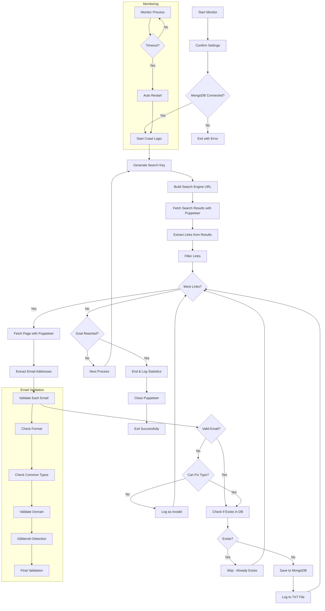

# #REPO-NAME#

A Node.js + Puppeteer.js application to fetch and validate email addresses by crawling web pages from search engine results using specific and random search keys.

Built in February 2020. This application automates the process of discovering email addresses across the web using intelligent search strategies, advanced validation, and MongoDB storage.

## Features

- 🔍 **Multi-Search Engine Support**: Crawls Bing and Google search results
- 🤖 **Headless Browser**: Uses Puppeteer.js for real browser-based page rendering
- ✉️ **Smart Email Validation**: Advanced validation with automatic typo correction
- 🗄️ **MongoDB Storage**: Stores and deduplicates email addresses
- 🔄 **Auto-Restart Monitor**: Automatically restarts on failures or timeouts
- 🎯 **Flexible Goals**: Stop based on email count, time duration, or links crawled
- 📊 **Real-Time Statistics**: Live console status updates with progress tracking
- 🧪 **Development Mode**: Test with local sources without making real requests
- 🚫 **Smart Filtering**: Configurable domain and email filters
- 📝 **Comprehensive Logging**: Logs all emails and links to TXT files
- 🇮🇱 **Hebrew Support**: Built-in Hebrew search key generation
- 🧹 **Gibberish Detection**: Filters out randomly generated email addresses

## Getting Started

### Prerequisites

- Node.js (v14 or higher)
- MongoDB (v4 or higher)
- npm or pnpm

### Installation

1. Clone the repository:

```bash
git clone https://github.com/orassayag/crawler.git
cd crawler
```

2. Install dependencies:

```bash
npm install
```

3. Ensure MongoDB is running:

```bash
mongod
```

4. For production mode with Puppeteer:

```bash
npm run preload
```

### Quick Start

#### Test Mode (Development)

```bash
# Edit src/settings/settings.js
# Set IS_PRODUCTION_MODE: false
# Set GOAL_VALUE: 10
npm start
```

#### Production Mode

```bash
# Edit src/settings/settings.js
# Set IS_PRODUCTION_MODE: true
# Configure search engines and keys
npm run preload
npm start
```

Type `y` when prompted to confirm settings and start crawling.

## Configuration

Edit `src/settings/settings.js` to configure:

### Core Settings

- `IS_PRODUCTION_MODE`: Use real crawling (`true`) or test mode (`false`)
- `GOAL_TYPE`: Stop condition - `EMAIL_ADDRESSES`, `MINUTES`, or `LINKS`
- `GOAL_VALUE`: Target value for the goal
- `IS_DROP_COLLECTION`: Clear database before starting

### Search Configuration

- `SEARCH_KEY`: Static search term or `null` for random keys
- `IS_ADVANCE_SEARCH_KEYS`: Use advanced Hebrew keys or basic static keys
- Search engines configured in `src/configurations/files/searchEngines.configuration.js`
- Search keys configured in `src/configurations/files/searchKeys.configuration.js`

### Filtering

- Email filters: `src/configurations/files/filterEmailAddress.configuration.js`
- Link filters: `src/configurations/files/filterLinkDomains.configuration.js`
- File extensions: `src/configurations/files/filterFileExtensions.configuration.js`

See [INSTRUCTIONS.md](INSTRUCTIONS.md) for detailed configuration options.

## Available Scripts

### Main Application

```bash
npm start              # Start crawler with monitoring
npm run backup         # Backup the project
npm run domains        # Count email domains from results
```

### Testing Scripts

```bash
npm run val            # Validate single email address
npm run valmany        # Validate multiple email addresses
npm run valdebug       # Debug email validation
npm run typos          # Test typo detection and correction
npm run link           # Test link crawling
npm run session        # Test session with predefined links
npm run generator      # Test email address generation
npm run cases          # Run email validation test cases
npm run sand           # General testing sandbox
```

## Project Structure

```
crawler/
├── src/
│   ├── monitor/              # Application entry point with restart logic
│   ├── scripts/              # Executable scripts
│   │   ├── crawl.script.js   # Main crawling script
│   │   ├── backup.script.js  # Backup script
│   │   └── domains.script.js # Domain counter script
│   ├── logics/               # Business logic orchestration
│   │   └── crawl.logic.js    # Core crawling logic
│   ├── services/             # Service layer
│   │   ├── crawlLink.service.js          # Link crawling
│   │   ├── crawlEmailAddress.service.js  # Email extraction
│   │   ├── emailAddressValidation.service.js # Email validation
│   │   ├── mongoDatabase.service.js      # Database operations
│   │   ├── puppeteer.service.js          # Browser automation
│   │   └── search.service.js             # Search key generation
│   ├── configurations/       # Configuration files
│   │   ├── searchEngines.configuration.js
│   │   ├── searchKeys.configuration.js
│   │   ├── filterEmailAddress.configuration.js
│   │   └── filterLinkDomains.configuration.js
│   ├── settings/             # Application settings
│   │   └── settings.js       # Main settings file
│   ├── core/                 # Core models and enums
│   │   ├── models/           # Data models
│   │   └── enums/            # Enumerations
│   ├── utils/                # Utility functions
│   └── tests/                # Test files
├── dist/                     # Output files (generated)
│   ├── production/           # Production mode outputs
│   └── development/          # Development mode outputs
├── sources/                  # Test sources for development mode
├── INSTRUCTIONS.md           # Detailed setup and usage guide
├── CONTRIBUTING.md           # Contribution guidelines
└── package.json
```

## How It Works



## Architecture Flow

1. **Monitor Layer**: Manages process lifecycle and auto-restart
2. **Crawl Logic**: Orchestrates the crawling process
3. **Search Service**: Generates search keys and builds search URLs
4. **Crawl Link Service**: Fetches and extracts links from search engines
5. **Puppeteer Service**: Handles browser automation
6. **Crawl Email Service**: Extracts emails from page sources
7. **Email Validation Service**: Validates and corrects emails
8. **MongoDB Service**: Handles database operations
9. **Log Service**: Manages console output and file logging

## Email Validation Features

The email validation service includes:

- **Format Validation**: Checks proper email structure
- **Typo Correction**: Automatically fixes common typos (e.g., `gmial.com` → `gmail.com`)
- **Domain Validation**: Verifies domain endings and structure
- **Gibberish Detection**: Filters out randomly generated strings
- **Common Domain Recognition**: Special handling for Gmail, Hotmail, etc.
- **Character Validation**: Removes invalid characters
- **Length Validation**: Enforces min/max length constraints

## Console Status Example

```
===IMPORTANT SETTINGS===
SEARCH ENGINES: bing, google
DATABASE: crawl032021
IS_PRODUCTION_MODE: true
IS_DROP_COLLECTION: false
GOAL_TYPE: MINUTES
GOAL_VALUE: 700
========================

===[SETTINGS] Mode: PRODUCTION | Plan: STANDARD | Database: crawl032021 | Active Methods: LINKS,CRAWL===
===[GENERAL] Time: 00.00:05:23 | Goal: MINUTES | Progress: 5/700 (00.71%) | Status: CRAWL | Restarts: 0===
===[PROCESS] Process: 3/10,000 | Page: 1/1 | Engine: Bing | Key: job developer===
===[LINK] Crawl: ✅  15 | Total: 42 | Filter: 27 | Error: 0 | Current: 3/15===
===[EMAIL ADDRESS] Save: ✅  12 | Total: 28 | Database: 15,927 | Exists: 14 | Invalid: ❌  2===
```

## Output Files

All output files are saved in `dist/production/YYYYMMDD_HHMMSS/` or `dist/development/`:

- `valid_email_addresses.txt` - Successfully validated emails
- `fix_email_addresses.txt` - Emails that were auto-corrected
- `invalid_email_addresses.txt` - Invalid emails that couldn't be fixed
- `crawl_links.txt` - All crawled page URLs
- `crawl_error_links.txt` - URLs that failed to load

## Development

### Running Tests

```bash
# Test email validation
npm run val

# Test link crawling
npm run link

# Test email generation
npm run generator

# Test typo correction
npm run typos
```

### Development Mode

Set `IS_PRODUCTION_MODE: false` in settings to:

- Use local HTML sources instead of real requests
- Test without Puppeteer
- Avoid rate limiting from search engines
- Debug faster without network delays

## Contributing

Contributions to this project are [released](https://help.github.com/articles/github-terms-of-service/#6-contributions-under-repository-license) to the public under the [project's open source license](LICENSE).

Everyone is welcome to contribute. Contributing doesn't just mean submitting pull requests—there are many different ways to get involved, including answering questions and reporting issues.

See [CONTRIBUTING.md](CONTRIBUTING.md) for detailed guidelines.

## Built With

- [Node.js](https://nodejs.org/) - JavaScript runtime
- [Puppeteer](https://pptr.dev/) - Headless browser automation
- [MongoDB](https://www.mongodb.com/) - Database
- [Mongoose](https://mongoosejs.com/) - MongoDB object modeling
- [Axios](https://axios-http.com/) - HTTP client
- [forever-monitor](https://github.com/foreversd/forever-monitor) - Process monitoring

## License

This application has an MIT license - see the [LICENSE](LICENSE) file for details.

## Author

- **Or Assayag** - _Initial work_ - [orassayag](https://github.com/orassayag)
- Or Assayag <orassayag@gmail.com>
- GitHub: https://github.com/orassayag
- StackOverflow: https://stackoverflow.com/users/4442606/or-assayag?tab=profile
- LinkedIn: https://linkedin.com/in/orassayag

## Acknowledgments

- Built for educational and research purposes
- Respects robots.txt and implements rate limiting
- Uses user-agent rotation to avoid detection
- Implements polite crawling practices
